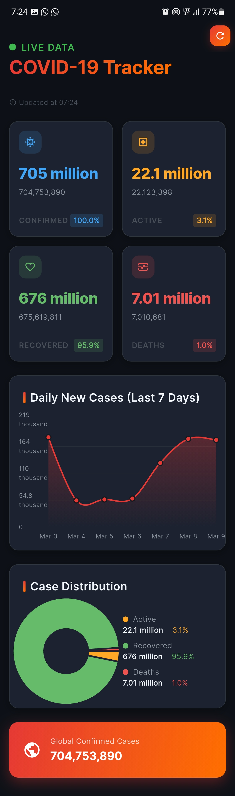

# E-Health: COVID-19 Tracker Dashboard

A professional-grade COVID-19 Tracker mobile application built 
with Flutter.


## Overview

This project is a polished, dark-themed dashboard that fetches 
real-time global 
statistics and historical data regarding COVID-19. It uses 
the [disease.sh API]
(https://disease.sh/) to display up-to-date information, 
employing interactive 
charts to visualize trends effectively.

## Architecture

The project strictly adheres to **Clean Architecture** 
principles and the 
**BLoC (Business Logic Component)** state management pattern.

The architecture is divided into three main layers:
* **Presentation Layer:** Contains the UI components, widgets, 
and BLoCs to manage screen states. Features responsive layouts and interactive charts.
* **Domain Layer:** Contains core business rules, entities, 
and repository interfaces. Completely independent of external libraries or frameworks.
* **Data Layer:** Implements repository interfaces, interacts 
with remote APIs using Dio, and handles data mapping/parsing.

# Screenshots

<p float="left" align="center">
   

</p>

## Key Features

* **Real-time COVID-19 Statistics:** Fetch and display the 
latest global and regional data.
* **Interactive Data Visualization:** Utilize Line and Bar 
charts (`fl_chart`) to analyze historical data trends.
* **Dark-Themed UI:** A modern, polished, and accessible dark 
theme interface utilizing standard material design and custom 
design systems.
* **Robust Networking:** Efficient API calls with error handling 
and interceptors powered by `dio`.
* **Predictable State Management:** Seamless state handling 
using `flutter_bloc` and `equatable`.
* **Shimmer Loading Effects:** Smooth placeholder animations 
while data is being fetched.

## Dependencies

Some of the main packages used in this project include:
* [flutter_bloc](https://pub.dev/packages/flutter_bloc) - State 
management
* [dio](https://pub.dev/packages/dio) - HTTP networking
* [fl_chart](https://pub.dev/packages/fl_chart) - Interactive 
charts
* [equatable](https://pub.dev/packages/equatable) - Value 
equality
* [shimmer](https://pub.dev/packages/shimmer) - Loading 
animations
* [google_fonts](https://pub.dev/packages/google_fonts) - Modern 
typography
* [intl](https://pub.dev/packages/intl) - Date formatting

## Getting Started

### Prerequisites

* Flutter SDK (`^3.8.0`)
* Dart SDK

### Installation

1. Clone the repository:
   ```bash
   git clone https://github.com/Marvelousahaiwe/covid19_Tracker.git  
   ```
2. Navigate to the project directory:
   ```bash
   cd covid19_Tracker
   ```
3. Get the packages:
   ```bash
   flutter pub get
   ```
4. Run the app:
   ```bash
   flutter run
   ```

## API Reference

The app uses the [disease.sh - Open Disease Data API](https://disease.sh/).
- General COVID-19 data: `https://disease.sh/v3/covid-19/all`
- Historical data: `https://disease.sh/v3/covid-19/historical`
